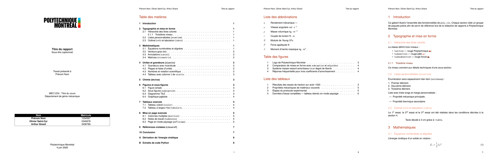

# PolyTeX
### Gabarit LaTeX pour Polytechnique Montréal
 
Classe LaTeX clé-en-main pour rédiger des rapports techniques conformes aux normes graphiques de Polytechnique Montréal.
 
[](https://github.com/arthgirard/polymtl_latex/actions/workflows/compile.yml)
[](LICENSE)
[](https://github.com/arthgirard/polymtl_latex/releases/download/latest/template.pdf)



---

## Prérequis système

L'utilisation de cette classe requiert l'installation d'une distribution LaTeX moderne (TeX Live, MacTeX ou MiKTeX).

Les utilitaires suivants doivent être accessibles :
* Compilateur : `pdflatex` ou `xelatex`
* Gestionnaire de bibliographie : `biber`
* Polices système : Les paquetages pour `Inconsolata` et `Helvetica` doivent être installés

---

## Guide de démarrage

Copiez l'intégralité des fichiers dans votre espace de travail et utilisez `main.tex` comme fichier racine.

### Initialisation du préambule

Configurez les métadonnées de votre équipe avant le marqueur de début de document :

```latex
\documentclass{poly}

\title{Titre du rapport}
\subtitle{Sous-titre du projet}
\professor{Nom de l'enseignant}
\sigle{SIG1234}
\coursetitle{Titre du cours}
\department{Département}

\addmember{Premier collaborateur}{1234567}
\addmember{Second collaborateur}{2345678}
% \addmember{Autres collaborateurs}{3456789}
\date{\today}
```

---

## Protocoles de compilation

### Méthode standard

L'indexation de la bibliographie nécessite plusieurs passes successives pour résoudre les liens croisés :

```bash
pdflatex main.tex
biber main
pdflatex main.tex
pdflatex main.tex
```

### Méthode automatisée

Si l'outil `latexmk` est installé sur votre système, exécutez la commande suivante pour gérer l'ensemble du cycle de génération automatiquement :

```bash
latexmk -pdf main.tex
```

Pour nettoyer le répertoire des fichiers temporaires à la fin du travail :

```bash
latexmk -c
```
